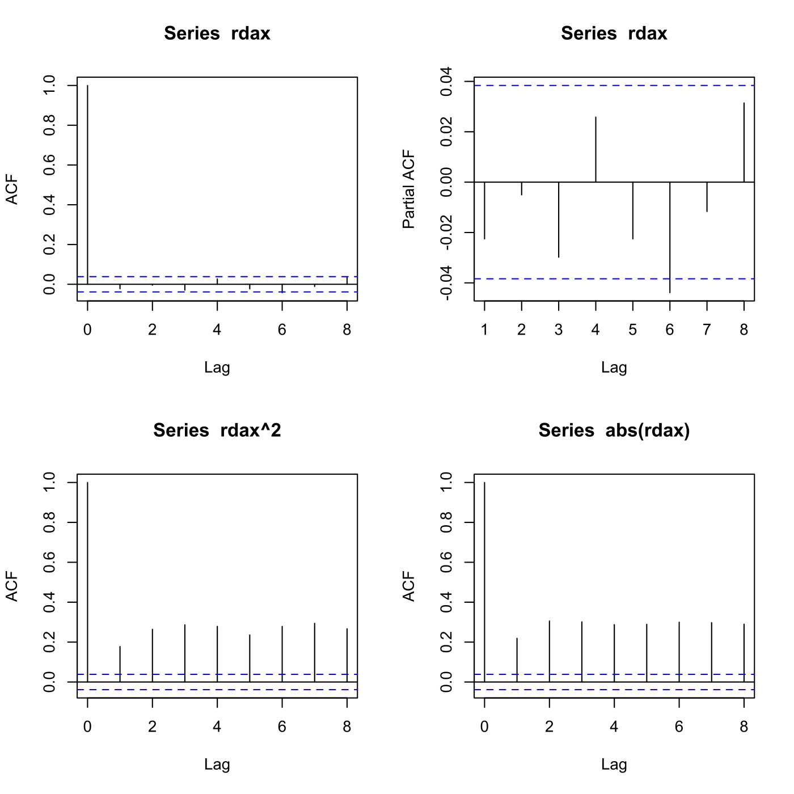
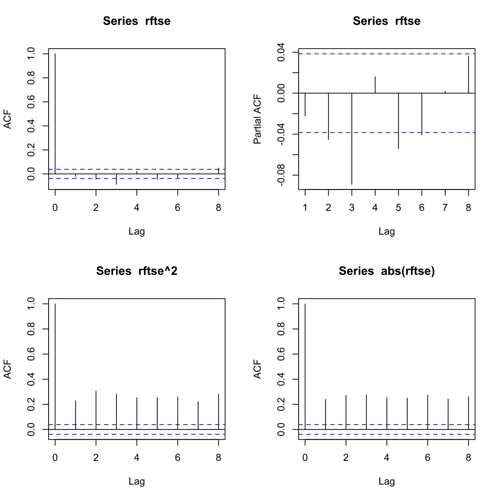

[](http://quantlet.de/index.php?p=info)

## [](http://quantlet.de/) **SFSautoparcorr** [](http://quantlet.de/d3/ia)

```yaml

Name of QuantLet : SFSautoparcorr

Published in : 'Statistics of Financial Markets : Exercises and Solutions'

Description : 'Reads data for DAX and FTSE 100 from 1 Jan to 31 Dec 2007, plots the autocorrelation
function and the partial autocorrelation function for returns, squared returns and absolute returns
for the two indexes. Performs Ljung-Box and ARCH test statistics.'

Keywords : 'Ljung-Box, PACF, acf, partial, autocorrelation, arch, volatility, index, dax, ftse100,
financial, returns, test, statistics, plot, graphical representation, data visualization'

See also : SFSarch

Author : Lasse Groth

Submitted : Mon, September 26 2011 by Awdesch Melzer

Datafiles : FTSE_DAX.dat

Output : Ljung-Box and ARCH test statistics.

Example: 
- 1: ACF and PACF plots for DAX plain, squared and absolute returns.
- 2: ACF and PACF plots for FTSE 100 plain, squared and absolute returns.

```






```r

# clear variables and close windows
rm(list = ls(all = TRUE))
graphics.off()

# install and load packages
libraries = c("fBasics", "FinTS")
lapply(libraries, function(x) if (!(x %in% installed.packages())) {
install.packages(x)
})
lapply(libraries, library, quietly = TRUE, character.only = TRUE)

# load data
DS = read.table("FTSE_DAX.dat")
D  = DS[, 1]        # date
S  = DS[, 2:43]     # S(t)
s  = log(S)         # log(S(t))
r  = matrix(, 2607, 42)

for (i in 1:42) r[, i] = diff(s[, i])
i = i + 1  # r(t)

rdax = r[, 1]  # DAX returns
rftse = r[, 22]  # FTSE 100 returns

# ACF and PACF plots - DAX index
par(mfrow = c(2, 2))
acf(rdax, lag.max = 8)        # autocorrelation for DAX returns
pacf(rdax, lag.max = 8)       # partial autocorrelation for DAX returns
acf(rdax^2, lag.max = 8)      # autocorrelation  for DAX squared returns
acf(abs(rdax), lag.max = 8)   # autocorrelation  for DAX absolute returns

# ACF and PACF plots - FTSE 100 index
dev.new()
par(mfrow = c(2, 2))
acf(rftse, lag.max = 8)       # autocorrelation for FTSE 100 returns
pacf(rftse, lag.max = 8)      # partial autocorrelation for FTSE 100 returns
acf(rftse^2, lag.max = 8)     # autocorrelation  for FTSE 100 squared returns
acf(abs(rftse), lag.max = 8)  # autocorrelation  for FTSE 100 absolute returns

# Ljung-Box (Q*(8)) and ARCH test statistics - DAX index
rdax.test = Box.test(rdax, lag = 8, type = c("Ljung-Box"))           # Q statistic for returns
rdax.sqtest = Box.test(rdax^2, lag = 8, type = c("Ljung-Box"))       # Q statistic for squared returns
rdax.abtest = Box.test(abs(rdax), lag = 8, type = c("Ljung-Box"))    # Q statistic for absolute returns
rdax.artest = ArchTest(rdax, 8)  # ARCH test statistics for returns

# Ljung-Box (Q*(8)) and ARCH test statistics - FTSE 100 index
rftse.test = Box.test(rftse, lag = 8, type = c("Ljung-Box"))         # Q statistic for returns
rftse.sqtest = Box.test(rftse^2, lag = 8, type = c("Ljung-Box"))     # Q statistic for squared returns
rftse.abtest = Box.test(abs(rftse), lag = 8, type = c("Ljung-Box"))  # Q statistic for absolute returns
rftse.artest = ArchTest(rftse, 8)  # ARCH test statistics for returns

# Ljung-Box (Q*(8)) and ARCH test statistics - Summary
print("Ljung-Box (Q*(8)) and ARCH test statistics summary - DAX")
print(rdax.test)
print(rdax.sqtest)
print(rdax.abtest)
print(rdax.artest)

# Ljung-Box (Q*(8)) and ARCH test statistics - Summary
print("Ljung-Box (Q*(8)) and ARCH test statistics summary - FTSE")
print(rftse.test)
print(rftse.sqtest)
print(rftse.abtest)
print(rftse.artest)
```
