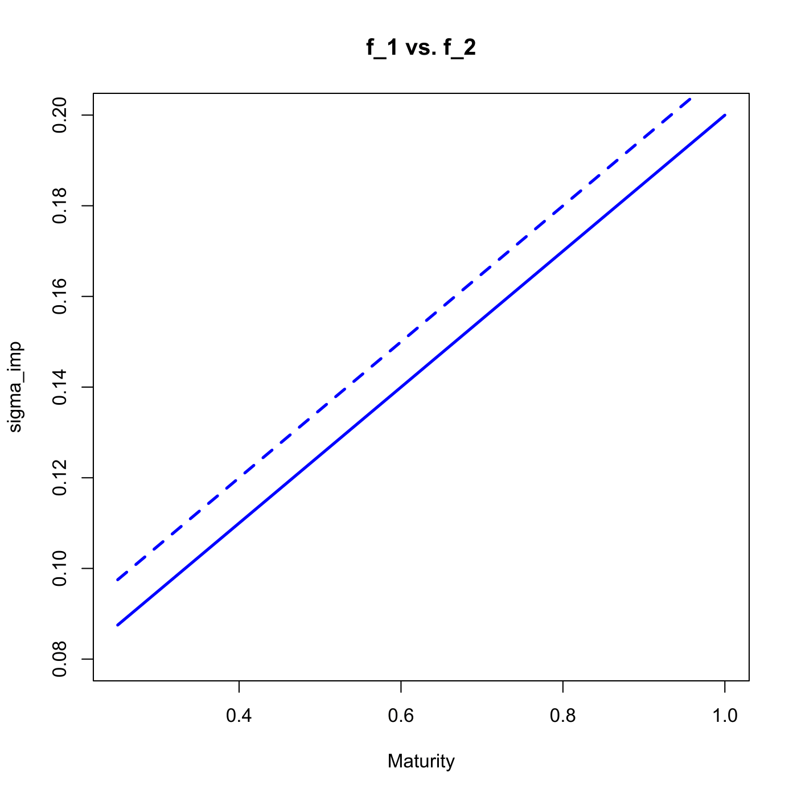
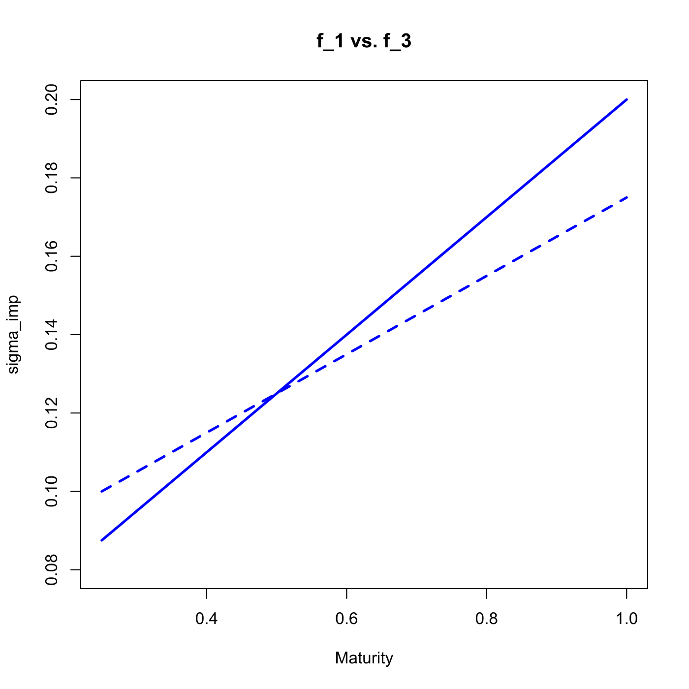

[](http://quantlet.de/index.php?p=info)

## [](http://quantlet.de/) **SFScalendarspread** [](http://quantlet.de/d3/ia)

```yaml

Name of QuantLet : SFScalendarspread

Published in : 'Statistics of Financial Markets : Exercises and Solutions'

Description : 'Calculates and compare the prices of the calendar spread for the following implied
volatility curves given as a function of maturity. (i) f1(tau) = 0.15 x tau + 0.05. (ii) f2(tau) =
0.15 x tau + 0.06. (iii)f3(tau) = 0.10 x tau + 0.075. The plots compare the functions f2 and f3 to
the function f1.'

Keywords : financial, implied-volatility, option, volatility, risk, graphical representation, plot

See also : SFSinterpolMaturity, SFSinterpolStrike, SFSriskreversal, SFSstickycall

Author : Lasse Groth

Submitted : Mon, September 26 2011 by Awdesch Melzer

Output : The prices of calendar spread for functions f1, f2 and f3.

Example: 
- 1: Comparison of f1 and f3
- 2: Comparison of f1 and f2

```






```r

# clear variables and close windows
rm(list = ls(all = TRUE))
graphics.off()

# parameter settings
S0     = 100                  # Closing price of underlying at time t_0
strike = 100                  # strike prices
tau    = seq(0.25, 1, 0.05)   # range of time to maturity
r      = 0.02                 # interest rate

# Define calendar spread
i1 = 1
i2 = 16

# define functions
f1 = function(x) 0.15 * x + 0.05  # initial
f2 = function(x) 0.15 * x + 0.06  # shifted
f3 = function(x) 0.1 * x + 0.075  # tilt

# Calculation of call option price by BS model
call_blsprice = function(S0, strike, r, tau, sigma) {
    d1 = (log(S0/strike) + (r + sigma^2/2) * tau)/(sigma * sqrt(tau))
    d2 = d1 - sigma * sqrt(tau)
    call_blsprice = S0 * pnorm(d1) - strike * exp(-r * tau) * pnorm(d2)
}

# calculate f1
ivterm = f1(tau)
call1  = call_blsprice(S0, strike, r, tau[i1], ivterm[i1])
call2  = call_blsprice(S0, strike, r, tau[i2], ivterm[i2])
CSp1   = call1 + call2

# f2
ivterm = f2(tau)
call1  = call_blsprice(S0, strike, r, tau[i1], ivterm[i1])
call2  = call_blsprice(S0, strike, r, tau[i2], ivterm[i2])
CSp2   = call1 + call2

# f3
ivterm = f3(tau)
call1  = call_blsprice(S0, strike, r, tau[i1], ivterm[i1])
call2  = call_blsprice(S0, strike, r, tau[i2], ivterm[i2])
CSp3   = call1 + call2

# final results
print("Prices of calendar spread")
print("  f1        f2        f3")
print(c(CSp1, CSp2, CSp3))

# difference f1 vs. f2
plot(tau, f1(tau), ylim = c(0.08, 0.2), type = "l", lwd = 2.5, col = "blue", xlab = "Maturity", 
    ylab = "sigma_imp")
lines(tau, f2(tau), lwd = 2.5, col = "blue", lty = 2)
title("f_1 vs. f_2")

# difference f1 vs. f3
dev.new()
plot(tau, f1(tau), ylim = c(0.08, 0.2), type = "l", lwd = 2.5, col = "blue", xlab = "Maturity", 
    ylab = "sigma_imp")
lines(tau, f3(tau), lwd = 2.5, col = "blue", lty = 2)
title("f_1 vs. f_3")

```
