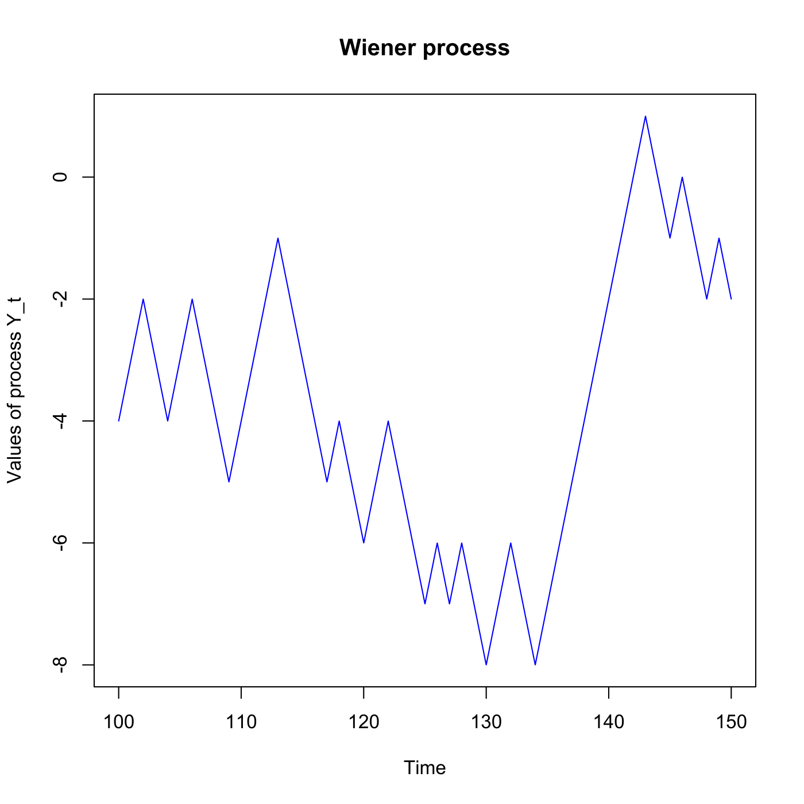

[](http://quantlet.de/index.php?p=info)

## [](http://quantlet.de/) **SFSwiener3** [](http://quantlet.de/d3/ia)

```yaml

Name of QuantLet : SFSwiener3

Published in : SFS

Description : Simulates a standard Wiener process Y_t=W_(T+t)-W_T, for T>0.

Keywords : 'brownian-motion, continuous, graphical representation, plot, process, simulation,
standard, stochastic, stochastic-process, time-series, wiener-process'

See also : SFSwiener1, SFSwiener1, SFSwiener2

Author : Lasse Groth

Submitted : Wed, July 29 2015 by quantomas

Input: 
- T: initial number of periods
- t: number of periods after T

Example : Plot of a Wiener process Y_t for T=100, t=50.

```




```r
# clear variables and close windows
rm(list = ls(all = TRUE))
graphics.off()

wiener3 = function(T, t) {
    l = T + t
    g = 0:l
    
    set.seed(0)
    z = runif(l, min = 0, max = 1)
    z = 2 * (z > 0.5) - 1
    x = c(0, cumsum(z))
    
    listik = cbind(g, x)
    
    # output
    plot(listik[(T + 1):(T + t + 1), 1], listik[(T + 1):(T + t + 1), 2], type = "l", 
        col = "blue", xlab = "Time", ylab = "Values of process Y_t")
    title("Wiener process")
    
}

wiener3(100, 50) 

```
