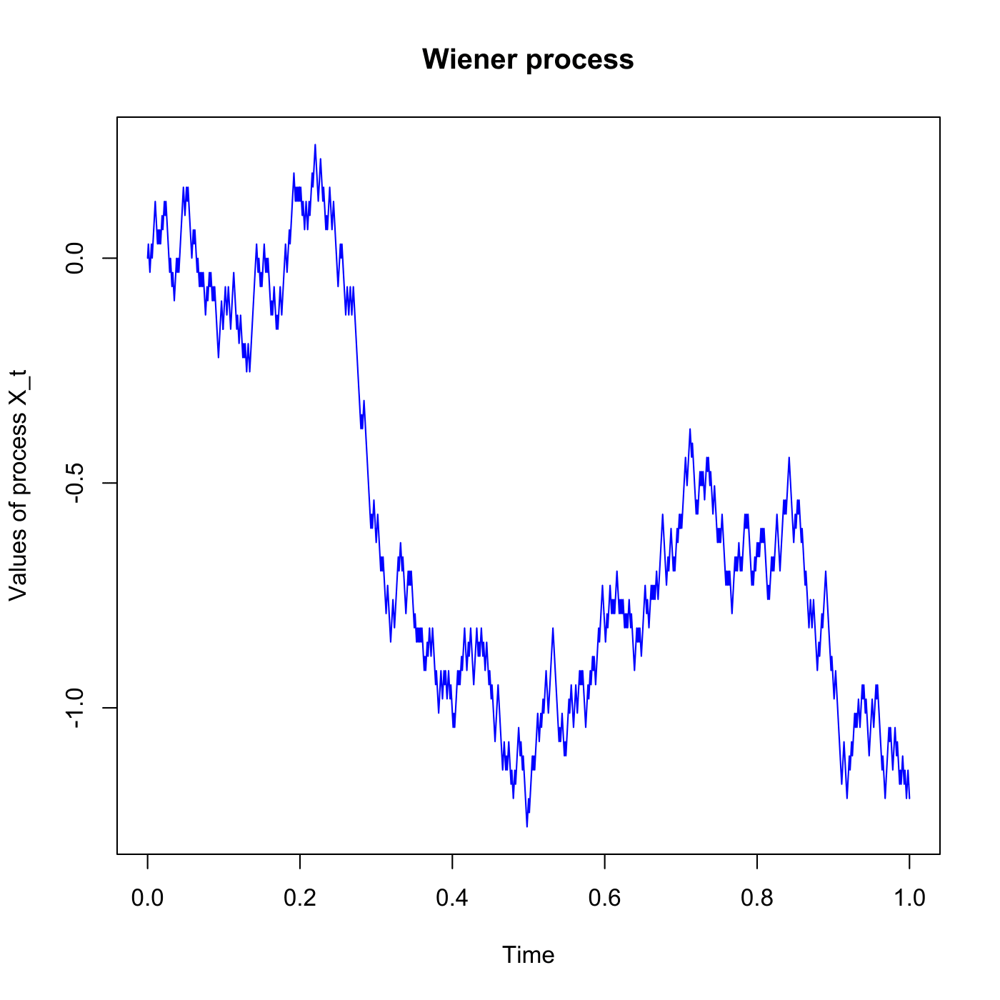

##  **SFSwiener1**

```yaml
Name of QuantLet : SFSwiener1 
Published in: SFS
Description: 'Simulates and plots a standard Wiener process W_t on 1000 equidistant points in interval [0, 1].'
Keywords: brownian-motion, continuous, graphical representation, plot, process, simulation, standard, stochastic, stochastic-process, time-series, wiener-process
See also: SFSwiener2, SFSwiener3
Author: Lasse Groth
Submitted: Wed, July 29 2015 by quantomas
Input: 'dt - delta t'
Example: 'Plot of a Wiener process W_t for dt=0.001.'
```




```r
# clear variables and close windows
rm(list = ls(all = TRUE))
graphics.off()

wiener1 = function(dt) {
    l = 1
    n = floor(l/dt)
    t = seq(0, n * dt, dt)
    
    set.seed(0)
    z = runif(n, min = 0, max = 1)
    z = 2 * (z > 0.5) - 1
    z = z * sqrt(dt)  #to get finite and non-zero varinace
    x = c(0, cumsum(z))
    
    listik = cbind(t, x)
    
    # output
    plot(listik[, 1], listik[, 2], type = "l", col = "blue", xlab = "Time", ylab = "Values of process X_t")
    title("Wiener process")
}

wiener1(0.001) 

```
