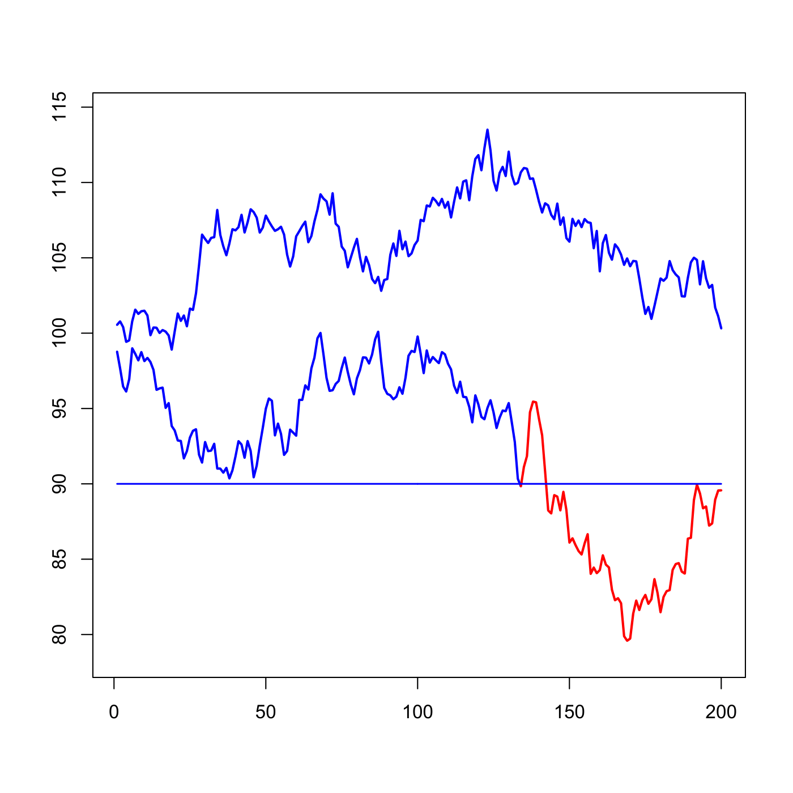

[](http://quantlet.de/index.php?p=info)

## [](http://quantlet.de/) **SFSrndbarrier** [](http://quantlet.de/d3/ia)

```yaml

Name of QuantLet : SFSrndbarrier

Published in : SFS

Description : 'Simulates 2 price paths of the barrier option. When the price hits the barrier
(lower path), the option expires worthless.'

Keywords : 'asset, exotic-option, financial, graphical representation, option, option-price, plot,
price, simulation'

Submitted : Wed, July 29 2015 by quantomas

```




```r
# clear variables and close windows
rm(list = ls(all = TRUE))
graphics.off()

n = 200
# generate two price series until one is below 90
ind = 0
while (ind == 0) {
    a1  = rnorm(n, 0, 1)
    a2  = rnorm(n, 0, 1)
    a11 = cumsum(a1) + 100
    a22 = cumsum(a2) + 100
    if ((min(a22) < 90) && (min(a11) > 90)) {
        ind = 1
    }
}

# find first value for which the price goes below 90
redindex = which(a22 < 90)
index    = seq(1, n, 1)
indexr   = seq(1, redindex[1], 1)
indexrr  = seq(redindex[1], n, 1)

# plot the two price series and indicate where the barrier is hit
plot(index, a11, col = "blue", lwd = 2, type = "l", ylim = c(min(a22) - 1, max(max(a22), 
    max(a11)) + 1), xlab = "", ylab = "")
lines(indexr, a22[1:redindex[1]], col = "blue", lwd = 2)
lines(indexrr, a22[(redindex[1]):n], col = "red", lwd = 2)
lines(index, 90 * rep(1, n), col = "blue", lwd = 1.5) 

```
