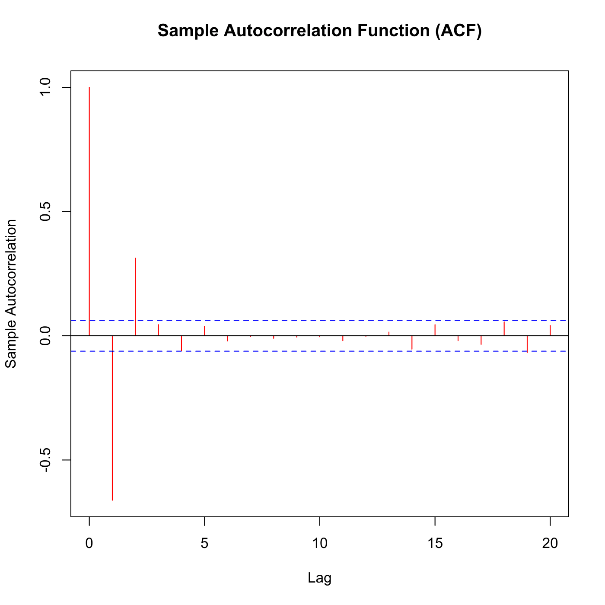

[](http://quantlet.de/index.php?p=info)

## [](http://quantlet.de/) **SFSacfMA3** [](http://quantlet.de/d3/ia)

```yaml

Name of QuantLet : SFSacfMA3

Published in : SFS

Description : Plots the autocorrelation function of an MA(3) (moving average) process.

Keywords : 'acf, autocorrelation, discrete, graphical representation, linear, moving-average, plot,
process, simulation, stationary, stochastic, stochastic-process, time-series'

Submitted : Wed, July 29 2015 by quantomas

Example : The simulation is produced for the random sample of 1000 observations.

```




```r
# clear variables and close windows
rm(list = ls(all = TRUE))
graphics.off()
set.seed(0)
x = rnorm(1002, 0, 1)
y = filter(filt = c(1, -1, 1), x = x)

autocorr = acf(y[2:1001], lag.max = 20, col = "red", main = "Sample Autocorrelation Function (ACF)", 
    ylab = "Sample Autocorrelation")
print(cbind(autocorr$lag, autocorr$acf)) 

```
