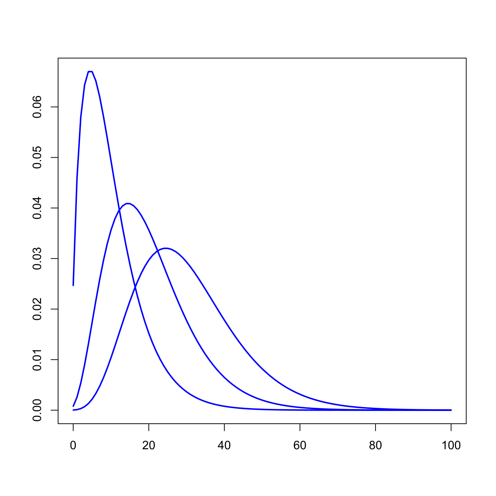
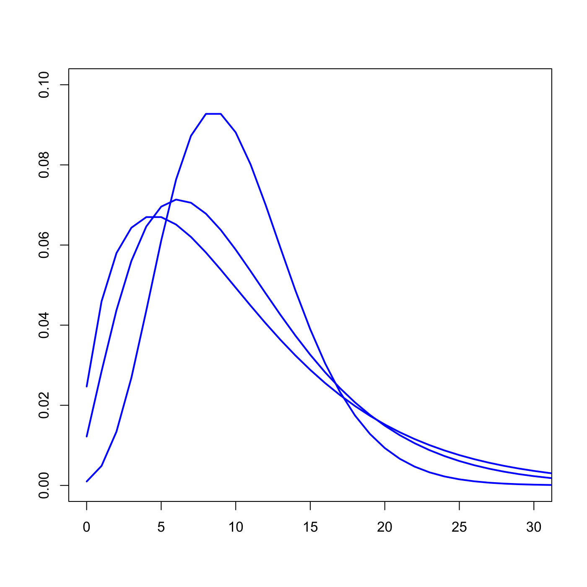

[](http://quantlet.de/index.php?p=info)

## [](http://quantlet.de/) **SFSLossPois** [](http://quantlet.de/d3/ia)

```yaml

Name of QuantLet : SFSLossPois

Published in : SFS

Description : 'Plots the loss distribution in the simplified Poisson model with default
probabilities comming from Gamma distribution.'

Keywords : 'default, distribution, gamma, graphical representation, loss-distribution, plot,
poisson, probability'

See also : SFSLossBern

Author : Lasse Groth

Submitted : Wed, July 29 2015 by quantomas

Example: 
- 1: 'The example is produced for the 100 obligors and Gamma parameters: (2,0.05), (4,0.05),
(6,0.05).'
- 2: 'The example is produced for the 100 obligors and Gamma parameters: (3,0.0333), (2,0.05),
(10,0.01).'

```






```r
# Close all plots and clear variables
graphics.off()
rm(list = ls(all = TRUE))

h   = 0.01
lam = seq(0, 1, h)
m   = 100
k   = seq(0, m, 1)
L1  = matrix(0, 1, m + 1)
L2  = L1
L3  = L1
L4  = L1
L5  = L1
L6  = L1

# Gamma pdfs with alpha = (2,4,6) and beta=5.
fp1 = dgamma(lam, 2, 0.05^(-1))
fp2 = dgamma(lam, 4, 0.05^(-1))
fp3 = dgamma(lam, 6, 0.05^(-1))

# Loss distribution with the Poisson model.
for (i in 1:(m + 1)) {
    L1[i] = sum(dpois(k[i], m * lam) * fp1 * h)
    L2[i] = sum(dpois(k[i], m * lam) * fp2 * h)
    L3[i] = sum(dpois(k[i], m * lam) * fp3 * h)
}

plot(k, L1, type = "l", col = "blue", lwd = 2, xlab = "", ylab = "")
lines(k, L2, col = "blue", lwd = 2)
lines(k, L3, col = "blue", lwd = 2)

# Gamma pdfs with alpha = (3,2,10) and beta=(3.33,5,1).
fp4 = dgamma(lam, 3, 0.0333^(-1))
fp5 = dgamma(lam, 2, 0.05^(-1))
fp6 = dgamma(lam, 10, 0.01^(-1))

for (i in 1:(m + 1)) {
    L4[i] = sum(dpois(k[i], m * lam) * fp4 * h)
    L5[i] = sum(dpois(k[i], m * lam) * fp5 * h)
    L6[i] = sum(dpois(k[i], m * lam) * fp6 * h)
}

dev.new()
plot(k, L4, type = "l", xlim = c(0, 30), ylim = c(0, 0.1), col = "blue", lwd = 2, 
    xlab = "", ylab = "")
lines(k, L5, col = "blue", lwd = 2)
lines(k, L6, col = "blue", lwd = 2) 

```
