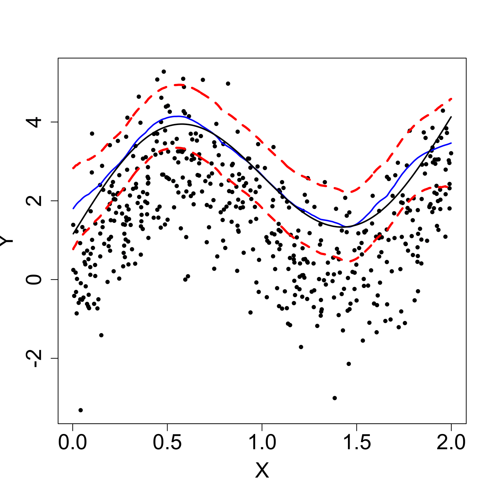
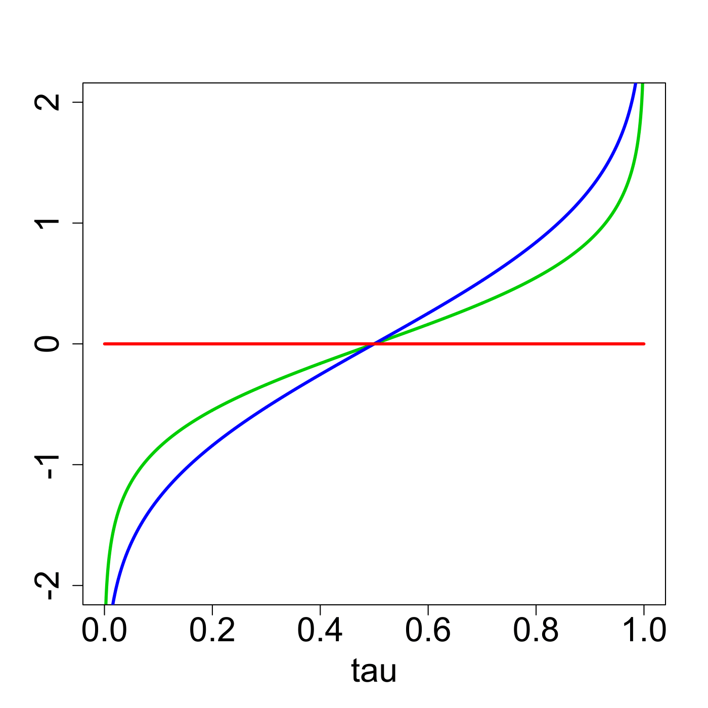

##  **SFSconfexpectile0.95**

```yaml
Name of QuantLet : SFSconfexpectile0.95
Published in: SFS
Description: 'Plots quantile and expectile curves for standard normal distribution and constructs 95% uniform confidence bands for the expectile function.'
Keywords: confidence-bands, expectile, extreme-value, graphical representation, normal, normal-distribution, plot, quantile, standard, uniform
See also: TERES_ExpectileQuantileDiff, TERES_ExpectileQuantileDiffMulti, TXTSimulation, TXTSimulationAttention, TXTSimulationBS
Author: Mengmeng Guo
Submitted: Wed, July 29 2015 by quantomas
Example: 
- 'Quantile curve (blue) and expectile curve (green) for N(0, 1).'
- 'Theoretical Expectile Curve (black), Estimated Expectile Curve (blue) and 95% Uniform Confidence Bands (red).'
```






```r
# clear variables and close windows
rm(list = ls(all = TRUE))
graphics.off()

# install and load packages
libraries = c("KernSmooth", "VGAM", "expectreg", "mboost")
lapply(libraries, function(x) if (!(x %in% installed.packages())) {
    install.packages(x)
})
lapply(libraries, library, quietly = TRUE, character.only = TRUE)


# this is for the nonparametric quantile regression

# modified from lprq, s.t. we can specify where to estimate quantiles
lprq2 = function(x, y, h, tau, x0) {
    xx = x0
    fv = xx
    dv = xx
    for (i in 1:length(xx)) {
        z     = x - xx[i]
        wx    = dnorm(z/h)
        r     = rq(y ~ z, weights = wx, tau = tau, ci = FALSE)
        fv[i] = r$coef[1]
        dv[i] = r$coef[2]
    }
    list(xx = xx, fv = fv, dv = dv)
}
# modified from lprq, s.t. we can specify where to estimate quantiles, but random quantiles
lprq3 = function(x, y, h, x0) {
    xx = x0
    fv = xx
    dv = xx
    for (i in 1:length(xx)) {
        z     = x - xx[i]
        wx    = dnorm(z/h)
        r     = rq(y ~ z, weights = wx, tau = runif(1), ci = FALSE)
        fv[i] = r$coef[1]
        dv[i] = r$coef[2]
    }
    list(xx = xx, fv = fv, dv = dv)
}

local.expectile = function(y, x, z, h, q) {
    # parameters: x=variable, h=bandwidth, z=grid point, ker=kernel
    nz  = length(z)
    nx  = length(x)
    x_0 = rep(1, nx * nz)
    dim(x_0) = c(nx, nz)
    x_1 = t(x_0)
    x0  = x * x_0
    w1  = 0 * y + 0.5
    y0  = y * x_0
    y11 = 0.5 * y * x_1
    x1  = z * x_1
    x10 = x0 - t(x1)
    x11 = kernel(x10/h)
    it  = 1
    dw1 = 1
    while (dw1 != 0 & it < 100) # while ( it < 500)
    {
        v1  = ((y0 < t(y11)) - 2 * q * (y0 < t(y11)) + q) * x11
        v2  = y * v1
        f1  = apply(v1, 2, mean)
        f2  = apply(v2, 2, mean)
        f   = f2/f1
        w01 = w1
        w1  = as.vector(ifelse(y0 > t(f3 * x_1), q, 1 - q))
        dw1 = sum(w1 != w01, na.rm = TRUE)
        y1  = f3
        y11 = f3 * x_1
        it  = it + 1
    }
    return(y1)
}

kernelq = function(u) {
    dnorm(u, mean = 0, sd = 1)
}
kernel = function(x) {
    0.75 * (1 - x^2) * (abs(x) <= 1)
}

coverate   = 0
area.cover = 0
B     = 500
n     = 500
q     = 0.95
h     = 0.2
alpha = 0.05
gridn = n
cc    = 1/4

set.seed(10 * 3)
x       = runif(n, 0, 2)
y       = 1.5 * x + 2 * sin(pi * x) + rnorm(n)
e_theor = 1.5 * x + 2 * sin(pi * x) + enorm(q)
z       = x
v       = x        # v for the nonparametric part
bound   = c(0, 1)
yuv     = sort(v)  # just sort them for later use
yur     = y[order(v)]

# the theoretical expectile for tau=0.9
yuv    = sort(v)  # just sort them for later use
yur    = y[order(v)]
h12    = (0.5 * (1 - 0.5)/dnorm(qnorm(0.5))^2)^0.2 * h
b2     = max(h/sd(yuv) * sd(yur), h12^5/(h)^3, h/10)
lambda = 1/(2 * sqrt(pi))  # this is for normal kernel, if quartic kernel, value is 5/7
delta  = -log(h)/log(n)

dd  = sqrt(2 * delta * log(n)) + (2 * delta * log(n))^(-1/2) * log(cc/2/pi)
fxd = bkde(yuv, gridsize = gridn, range.x = c(min(z), max(z)))

values   = local.expectile(y, x, z, h, q)
yy1      = y - values[order(x)]
fx_yy    = bkde(sort(yy1), gridsize = gridn, range.x = c(min(yy1), 0))
delta_yy = c(min(yy1), fx_yy$x)
sigma    = q^2 * mean(yy1^2) + (1 - 2 * q) * sum(yy1^2 * fx_yy$y * diff(delta_yy))
f_x      = ecdf(yy1)
fx       = q + (1 - 2 * q) * f_x(0)

# fx=f_x(yy1,z,h,q) sigma1=sigma(yy1,z,h,q)
bandt      = (fxd$y)^(1/2) * fx
cn         = log(2) - log(abs(log(1 - alpha)))
band       = (n * h)^(-1/2) * sqrt(lambda * sigma) * bandt^(-1) * (dd + cn * (2 * delta * 
    log(n))^(-1/2))
coverate1  = min(e_theor[order(x)] <= values[order(x)] + band, e_theor[order(x)] >= 
    values[order(x)] - band)
coverate   = coverate + coverate1
area.cover = mean(band) + area.cover
plot(x, y, type = "p", pch = 20, ylim = c(min(y), max(y)), xlab = "X", ylab = "Y", 
    cex.lab = 1.8, cex.axis = 1.8)
lines(sort(x), values[order(x)], col = "blue", lwd = 2, type = "l")
lines(sort(x), e_theor[order(x)], lwd = 2, col = 1)
lines(sort(x), values[order(x)] - band, col = "red", lty = 2, lwd = 3)
lines(sort(x), values[order(x)] + band, col = "red", lty = 2, lwd = 3)


## Plot the quantile and expectile curves for standard normal distribution.
dev.new()
x  = seq(1e-04, 0.9999, length = 1000)
y1 = qenorm(x)
y2 = qnorm(x)
y  = cbind(y1, y2, 0)
matplot(x, y, type = "l", lty = 1, cex.axis = 2, cex.lab = 2, xlab = "tau", ylab = "", 
    lwd = 3, col = c(3, 4, 2), ylim = c(-2, 2)) 

```
