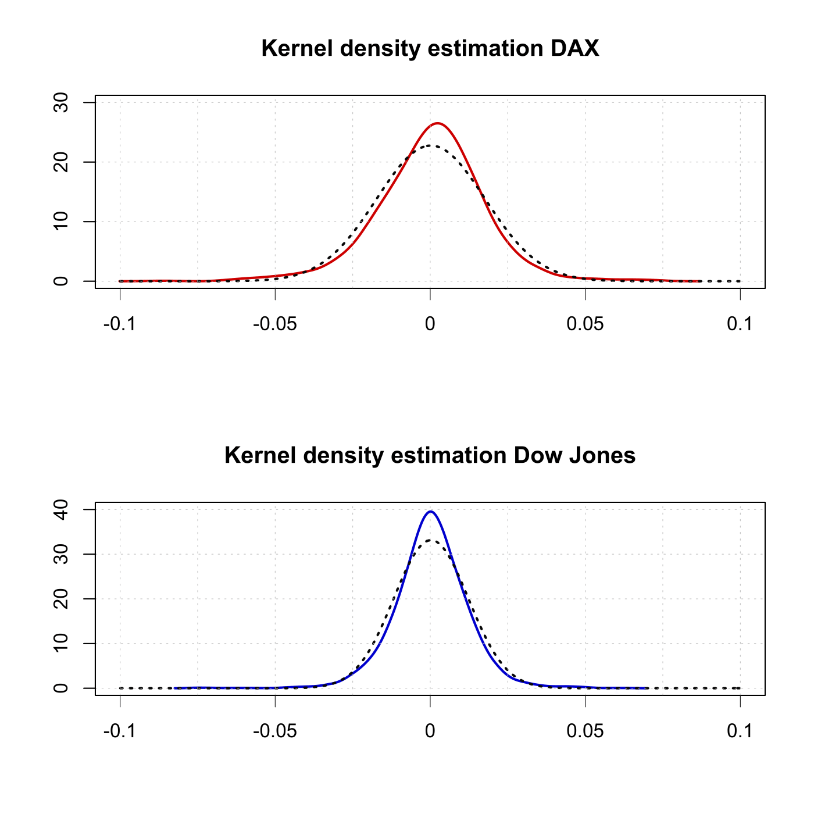

##  **SFSdaxdowkernel**

```yaml
Name of QuantLet : SFSdaxdowkernel
Published in: SFS
Description: 'Plots density functions of DAX (upper panel) and Dow Jones (lower panel) index and the normal density (dashed line), estimated nonparametrically with Gaussian kernel.'
Keywords: data visualization, dax, density, dow-jones, estimation, financial, gaussian, graphical representation, index, kernel, log-returns, nonparametric, nonparametric estimation, normal, plot, time-series, visualization
See also: SFStimeseries, SFStimeseries
Submitted: Sun, August 02 2015 by quantomas
Datafiles: daxdow.txt
Example: 'Kernel density estimates of DAX and Dow Jones using the data from the period from 1997 to 2004.'
```




```r
# clear variables and close windows
rm(list = ls(all = TRUE))
graphics.off()

# install and load packages
libraries = c("KernSmooth")
lapply(libraries, function(x) if (!(x %in% installed.packages())) {
    install.packages(x)
})
lapply(libraries, library, quietly = TRUE, character.only = TRUE)

# Load dataset
daxdow = read.table("daxdow.txt")

dax = daxdow[, 1]
dow = daxdow[, 2]

# Compute differences/returns daxret = price2ret(dax,[],'Periodic'), dowret = price2ret(dow,[],'Periodic')

daxret = cbind(diff(dax))
dowret = cbind(diff(dow))

# Log-returns
daxretlog = cbind(diff(log(dax)))
dowretlog = cbind(diff(log(dow)))

# Absolute log-returns
daxretlogabs = abs(daxretlog)
dowretlogabs = abs(dowretlog)

# Kernel Density Estimation DAX
f1    = daxretlog
fdax  = bkde(daxretlog, kernel = "biweight")  #Compute kernel density estimate
par(mfrow = c(2, 1))
plot(fdax, type = "l", lwd = 2, col = "red3", ylab = "", xlab = "", axes = FALSE, 
    frame = TRUE, xlim = c(-0.1, 0.1), ylim = c(0, 30), main = "Kernel density estimation DAX")
f2 		= daxretlog
range = seq(-0.1, 0.1, by = 0.001)
m     = mean(f2)
sdd   = sd(c(f2))
lines(range, dnorm(range, m, sdd), lty = "dotted", lwd = 2, col = "grey3")

abline(h = seq(0, 40, by = 10), lty = "dotted", lwd = 0.5, col = "grey")
abline(v = seq(-0.1, 0.1, 0.025), lty = "dotted", lwd = 0.5, col = "grey")
axis(side = 2, at = seq(0, 40, by = 10), label = seq(0, 40, by = 10), lwd = 1)
axis(side = 1, at = seq(-0.1, 0.1, 0.05), label = seq(-0.1, 0.1, 0.05), lwd = 0.5)

# Kernel Density Estimation Dow
fdow  = bkde(dowretlog, kernel = "biweight")  #Compute kernel density estimate
plot(fdow, type = "l", lwd = 2, col = "blue3", ylab = "", xlab = "", axes = FALSE, 
    frame = TRUE, xlim = c(-0.1, 0.1), ylim = c(0, 40), main = "Kernel density estimation Dow Jones")
f3    = dowretlog
range = seq(-0.1, 0.1, by = 0.001)
m     = mean(f3)
sdd   = sd(c(f3))
lines(range, dnorm(range, m, sdd), lty = "dotted", lwd = 2, col = "grey3")

abline(h = seq(0, 40, by = 10), lty = "dotted", lwd = 0.5, col = "grey")
abline(v = seq(-0.1, 0.1, 0.025), lty = "dotted", lwd = 0.5, col = "grey")
axis(side = 2, at = seq(0, 40, by = 10), label = seq(0, 40, by = 10), lwd = 1)
axis(side = 1, at = seq(-0.1, 0.1, 0.05), label = seq(-0.1, 0.1, 0.05), lwd = 0.5)
 

```
