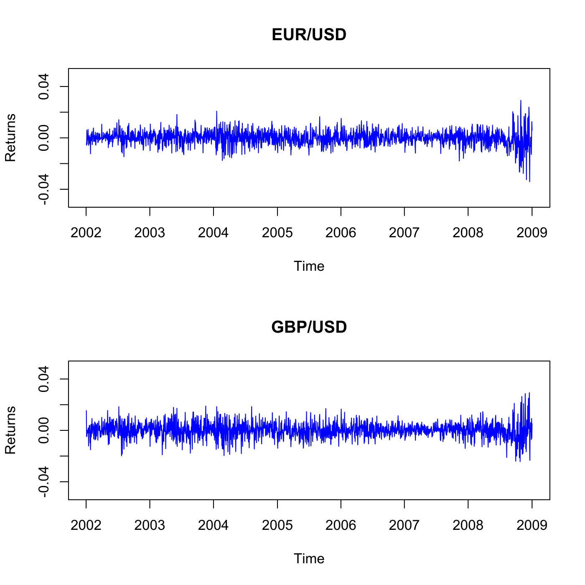

##  **SFSmvol01**

```yaml
Name of QuantLet : SFSmvol01
Published in: SFS
Description: 'Calculates the summary statistics for the EUR/USD and GBP/USD exchange rates and plots the time series of daily returns on both exchange rates for the period from 1 January 2002 to 1 January 2009.'
Keywords: correlation matrix, data visualization, descriptive-statistics, exchange-rate, financial, graphical representation, plot, returns, standard deviation, summary, time-series, visualization
Author: Zografia Anastasiadou
Submitted: Mon, August 03 2015 by quantomas
Datafiles: fx_eur_gbp_usd.txt
```




```r
# clear variables and close windows
rm(list = ls(all = TRUE))
graphics.off()

fx = read.table("fx_eur_gbp_usd.txt")

# Convert FX-rates to return series
fx = log(fx)

x = diag(-1, length(fx[, 1]), length(fx[, 1]))
x[row(x) == (col(x) + 1)] = 1

dem_usd = t(fx[, 1]) %*% x
gbp_usd = t(fx[, 2]) %*% x

returns = cbind(t(dem_usd), t(gbp_usd))
returns = returns[-dim(returns)[1], ] 		# remove last entry

# Summary statistics, standard deviation and correlation matrix is calculated
summary(returns)
sd(returns)
cor(returns)

# Plot return series
par(mfrow = c(2, 1))

plot(returns[, 1], type = "l", xlab = "Time", ylab = "Returns", xaxt = "n", ylim = c(-0.05, 
    0.05), col = "blue")
axis(side = 1, at = c(0, 261, 522, 784, 1044, 1304, 1565, 1827), labels = c("2002", 
    "2003", "2004", "2005", "2006", "2007", "2008", "2009"))
title("EUR/USD")

plot(returns[, 2], type = "l", xlab = "Time", ylab = "Returns", xaxt = "n", ylim = c(-0.05, 
    0.05), col = "blue")
axis(side = 1, at = c(0, 261, 522, 784, 1044, 1304, 1565, 1827), labels = c("2002", 
    "2003", "2004", "2005", "2006", "2007", "2008", "2009"))
title("GBP/USD") 

```
