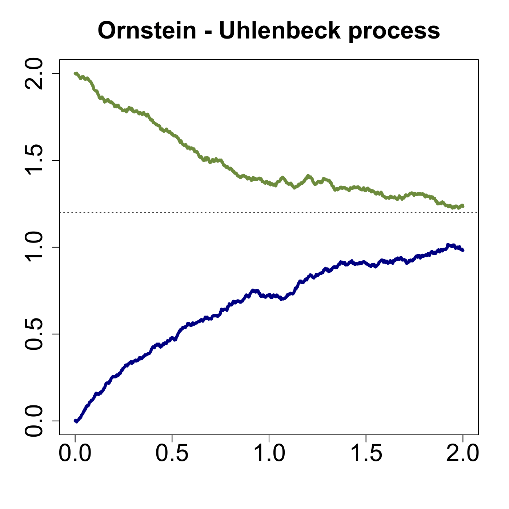

##  **SFSornstein**

```yaml
Name of QuantLet : SFSornstein 
Published in: SFS
Description: 'Produces a graphic visualisation of an Ornstein-Uhlenbeck process with different initial values.'
Keywords: gaussian, graphical representation, ornstein-uhlenbeck, plot, process, simulation, stochastic, stochastic-process, wiener-process
Submitted: Mon, August 03 2015 by quantomas
Example: 'The example is produced for initial values 2 and 0, mu = 1, eta = 1.2 and sigma = 0.3.'


```




```r
# clear variables and close windows
rm(list = ls(all = TRUE))
graphics.off()

ou = function(theta = 1, mu = 1.2, sigma = 0.3, init = c(mu, sigma^2/(2 * theta)), 
    from = 0, to = 2, steps = 500 * (to - from)) {
    t    = seq(from, to, length = steps)
    oup  = rnorm(n = 1, mean = init[1], sd = sqrt(init[2]))
    for (i in (1:(steps - 1))) {
        oup[i + 1] = oup[i] + theta * (mu - oup[i]) * (to - from)/steps + sigma * 
            rnorm(n = 1, mean = 0, sd = sqrt(sigma^2 * (to - from)/steps))
    }
    return(oup)
}

cols = c("navy", "darkolivegreen4", "red")
t    = seq(0, 2, length = 1000)
set.seed(311051)

# Plot
matplot(t, ou(init = c(0, 0)), type = "l", xlab = "", cex.axis = 2, ylab = "", col = cols[1], 
    lwd = 4, ylim = c(0, 2))
lines(t, ou(init = c(2, 0)), col = cols[2], lwd = 4)
title("Ornstein - Uhlenbeck process", cex.main = 2)
abline(h = 1.2, lty = 3, col = "grey25") 

```
