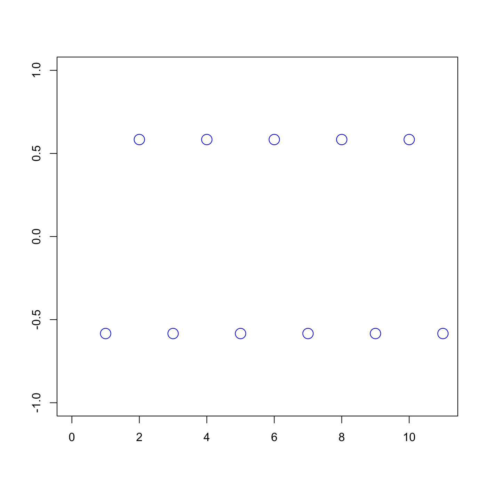

[](http://quantlet.de/index.php?p=info)

## [](http://quantlet.de/) **SFSsamplepath** [](http://quantlet.de/d3/ia)

```yaml

Name of QuantLet : SFSsamplepath

Published in : SFS

Description : 'Produces a plot of the sample path for a stochastic process X_t = (-1)^t * X, t = 1,
2,... with a random variable X.'

Keywords : 'discrete, graphical representation, plot, process, random, simulation, stochastic,
stochastic-process, time-series'

Author : Lasse Groth

Submitted : Mon, August 03 2015 by quantomas

Input: 
- t: time horizon
- x: starting value

Example : The example is produced for x = 0.5836 and t = 11.

```




```r

# clear variables and close windows
rm(list = ls(all = TRUE))
graphics.off()

t = 11
x = 0.5836
y = NULL

for (i in 1:t) {
    z = (-1)^i * x
    y = rbind(y, z)
    i = i + 1
}
x_a = 1:t

plot(x_a, y[1:t, ], xlim = c(0, t), ylim = c(-1, 1), col = "blue", cex = 2, xlab = c(""), 
    ylab = c(""))
 
```
