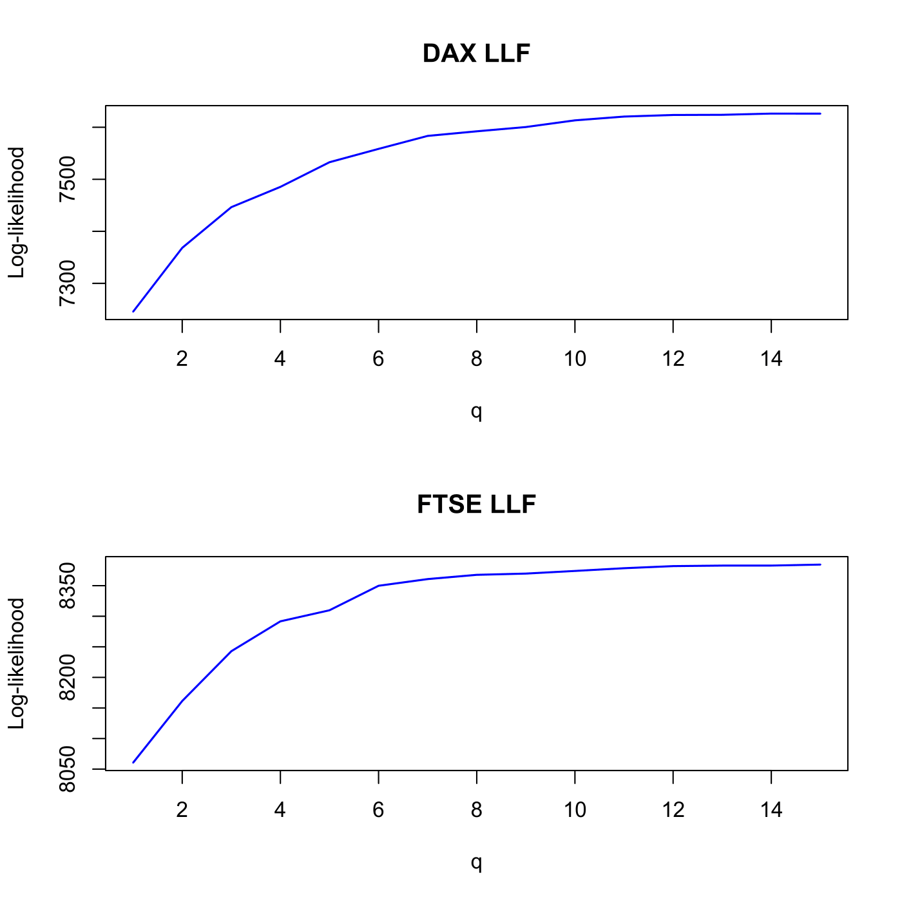
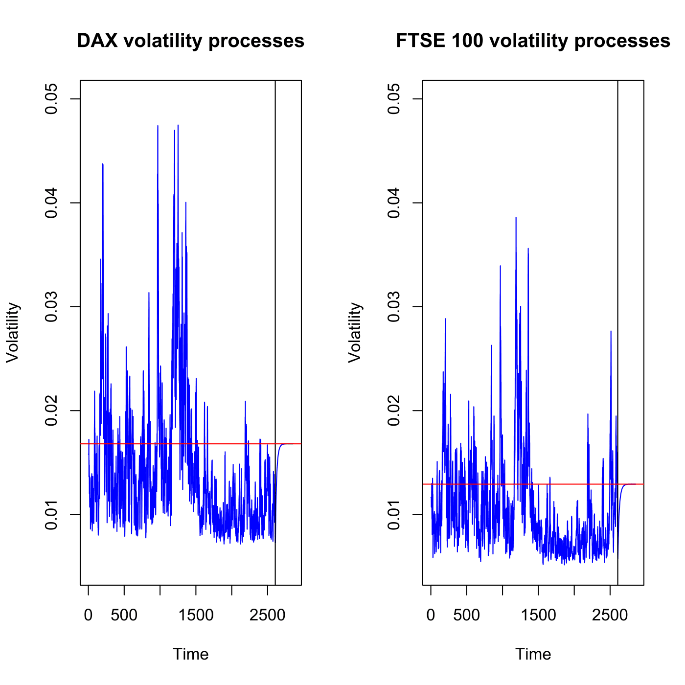

##  **SFSarch**

```yaml
Name of QuantLet : SFSarch
Published in: SFS
Description: 'Models the volatility processes for the DAX and FTSE 100 returns from 1 January 1998 to 31 December 2007 as an ARCH(6) process.'
Keywords: arch, autoregressive, data visualization, dax, estimation, financial, forecast, ftse100, graphical representation, index, likelihood, log-likelihood, plot, process, returns, simulation, stochastic, stochastic-process, time-series, volatility
See also: SFSautoparcorr
Author: Lasse Groth
Submitted: Wed, August 05 2015 by quantomas
Datafiles: FTSE_DAX.dat
Output: 
- 'Plots of the log-likelihood objective functions and of forecasts of the estimated volatility processes.'
- 'Estimated parameters for the return and volatility equations.'
Example:
- 'The values of the Log-likelihood function based on the ARCH(6) model for the volatility processes of DAX and FTSE 100 returns.'
- 'Estimated and forecasted volatility processes of DAX and FTSE 100 returns based on an ARCH(6) model. The solid line denotes the unconditional volatility.'
```






```r

# clear variables and close windows
rm(list = ls(all = TRUE))
graphics.off()

# install and load packages
libraries = c("tseries", "fGarch")
lapply(libraries, function(x) if (!(x %in% installed.packages())) {
    install.packages(x)
})
lapply(libraries, library, quietly = TRUE, character.only = TRUE)

DS = read.table("FTSE_DAX.dat")

D = DS[, 1]             # date
S = DS[, 2:43]          # S(t)
s = log(S)              # log(S(t))
r = matrix(, 2607, 42)

for (i in 1:42) r[, i] = diff(s[, i])  # r(t)
i = i + 1

rdax 	= r[, 1]  # DAX returns
rftse 	= r[, 22]  # FTSE 100 returns

# ARCH(q) models for the volatility process of DAX returns
for (i in 1:15) {
    assign(paste("dax.garch", i, sep = ""), garchFit(substitute(~garch(i, 0), list(i = i, 
        0)), rdax, trace = FALSE))
    assign(paste("ftse.garch", i, sep = ""), garchFit(substitute(~garch(i, 0), list(i = i, 
        0)), rftse, trace = FALSE))
}

# Read the optimized log-likelihood value for q=1:15
dax.LLF = c(dax.garch1@fit$llh, dax.garch2@fit$llh, dax.garch3@fit$llh, dax.garch4@fit$llh, 
    dax.garch5@fit$llh, dax.garch6@fit$llh, dax.garch7@fit$llh, dax.garch8@fit$llh, 
    dax.garch9@fit$llh, dax.garch10@fit$llh, dax.garch11@fit$llh, dax.garch12@fit$llh, 
    dax.garch13@fit$llh, dax.garch14@fit$llh, dax.garch15@fit$llh) * (-1)

ftse.LLF = c(ftse.garch1@fit$llh, ftse.garch2@fit$llh, ftse.garch3@fit$llh, ftse.garch4@fit$llh, 
    ftse.garch5@fit$llh, ftse.garch6@fit$llh, ftse.garch7@fit$llh, ftse.garch8@fit$llh, 
    ftse.garch9@fit$llh, ftse.garch10@fit$llh, ftse.garch11@fit$llh, ftse.garch12@fit$llh, 
    ftse.garch13@fit$llh, ftse.garch14@fit$llh, ftse.garch15@fit$llh) * (-1)

# Plot the optimized log-likelihood function for different q
par(mfrow = c(2, 1))

plot(dax.LLF, type = "l", xlab = "q", ylab = "Log-likelihood", col = "blue", lwd = 1.5)
title("DAX LLF")
plot(ftse.LLF, type = "l", xlab = "q", ylab = "Log-likelihood", col = "blue", lwd = 1.5)
title("FTSE LLF")


# ARCH(6) model for the volatility process of DAX returns
dax.arch6   = garchFit(~garch(6, 0), rdax, trace = FALSE)
#Volatility forcast based on estimated parameters
dax.predict = predict(dax.arch6, 250, trace = FALSE)

# Conditional volatility forecast
sigmafdax   = dax.predict[, 3]
# Unconditional volatility
sigmauncdax = sqrt(dax.arch6@fit$matcoef[2, 1]/(1 - sum(dax.arch6@fit$matcoef[3:8, 1])))

# AR(3)-ARCH(6) model for the volatility process of FTSE 100 returns
ftse.arch6   = garchFit(~garch(6, 0), rftse, trace = FALSE)
#arma(3,0) +  Volatility forecast based on estimated parameters
ftse.predict = predict(ftse.arch6, 250, trace = FALSE)

sigmafftse   = ftse.predict[, 3]  #Conditional volatility forecast
sigmauncftse = sqrt(ftse.arch6@fit$matcoef[2, 1]/(1 - sum(ftse.arch6@fit$matcoef[3:8, 1])))

# Plots of the estimated and forecasted unconditional and conditional volatility processes
dev.new()
par(mfrow = c(1, 2))

plot(c(dax.arch6@sigma.t, dax.predict[, 3]), type = "l", col = "blue", ylab = "Volatility", 
    xlab = "Time", ylim = c(0.005, 0.05))
abline(v = 2607)
abline(h = sigmauncdax, col = "red")
title("DAX volatility processes")

plot(c(ftse.arch6@sigma.t, ftse.predict[, 3]), type = "l", col = "blue", ylab = "Volatility", 
    xlab = "Time", ylim = c(0.005, 0.05))
abline(v = 2607)
abline(h = sigmauncftse, col = "red")
title("FTSE 100 volatility processes")

# Display estimated parameter for DAX return and volatility process
print("Estimated parameters for the return process - DAX")
print("epsilon")
print(dax.arch6@fit$matcoef[1, 1])

print("Estimated parameters for the volatility equation - DAX")
print(dax.arch6@fit$matcoef[3:8, 1])
print(" ")
print("omega")
print(dax.arch6@fit$matcoef[2, 1])

# Display estimated parameter for FTSE 100 return and volatility process
print("Estimated parameters for the return process - FTSE 100")
print("AR components")
print(ftse.arch6@fit$matcoef[2:4, 1])
print(" ")
print("epsilon")
print(ftse.arch6@fit$matcoef[1, 1])

print("Estimated parameters for the volatility equation - FTSE 100")
print(ftse.arch6@fit$matcoef[3:8, 1])
print(" ")
print("omega")
print(ftse.arch6@fit$matcoef[2, 1])

```
