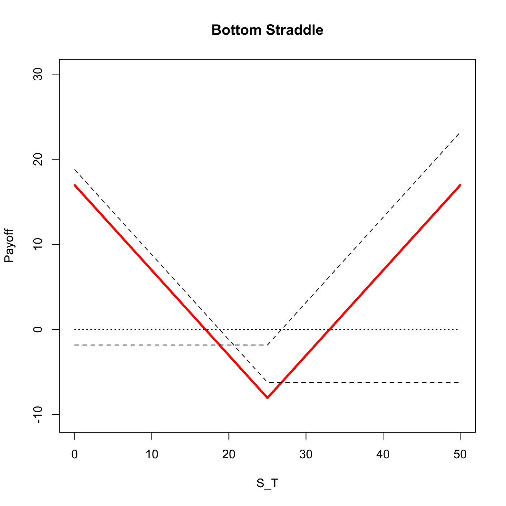

[](http://quantlet.de/index.php?p=info)

## [](http://quantlet.de/) **SFSbottomstraddle** [](http://quantlet.de/d3/ia)

```yaml

Name of QuantLet : SFSbottomstraddle

Published in : SFS

Description : 'Plots the combination of a long call and a long put with the same strike, i.e. a
straddle option strategy.'

Keywords : 'asset, black-scholes, call, derivative, european-option, financial, graphical
representation, option, option-price, plot, price, simulation, stock-price'

See also : SFSbottomstrangle, SFSbutterfly, SFSpayoffcollar, SFSstrap, SFSstrip

Author : Lasse Groth

Submitted : Wed, August 05 2015 by quantomas

Input: 
- St: stock price
- K: strike price
- r: interest rate
- T: time to expiration
- sigma: volatility

Example : 'The example is produced for the values: St=20, K=25, r=0.03, T=1 and sigma = 0.4.'

```




```r

# clear variables and close windows
rm(list = ls(all = TRUE))
graphics.off()

straddle = function(St, K, r, T, sigma) {
    
    # Calculate the terms for the BS option prices
    d1 = (log(St/K) + (r + sigma^2/2) * T)/(sigma * sqrt(T))
    d2 = d1 - sigma * sqrt(T)
    
    # Calculate the plain vanilla option prices
    cal = St * pnorm(d1) - K * exp(-r * T) * pnorm(d2)
    put = -St * pnorm(-d1) + K * exp(-r * T) * pnorm(-d2)
    
    # Value of plain vanilla options at time T
    cal_T = cal * exp(r * T)
    put_T = put * exp(r * T)
    
    # Set the coordinates
    x = c(0, K, 2 * K)
    
    # Calculate the pay-off at each coordinate
    y1 = c(-cal_T, -cal_T, K - cal_T)
    y2 = c(K - put_T, -put_T, -put_T)
    
    # Determine the strategy pay-off
    y = y1 + y2
    
    # Plot straddle option strategy pay-off
    plot(x, y, type = "l", lwd = 3, col = "red", xlab = "S_T", ylab = "Payoff", xlim = c(0, 
        2 * K), ylim = c(-1.3 * (cal_T + put_T), 1.3 * (K - min(cal_T, put_T))))
    title("Bottom Straddle")
    
    # Plot plain vanilla option payoff profiles
    lines(x, y1, lty = 2)
    lines(x, y2, lty = 2)
    lines(x, c(0, 0, 0), lty = 3)
}

straddle(20, 25, 0.03, 1, 0.4) 

```
